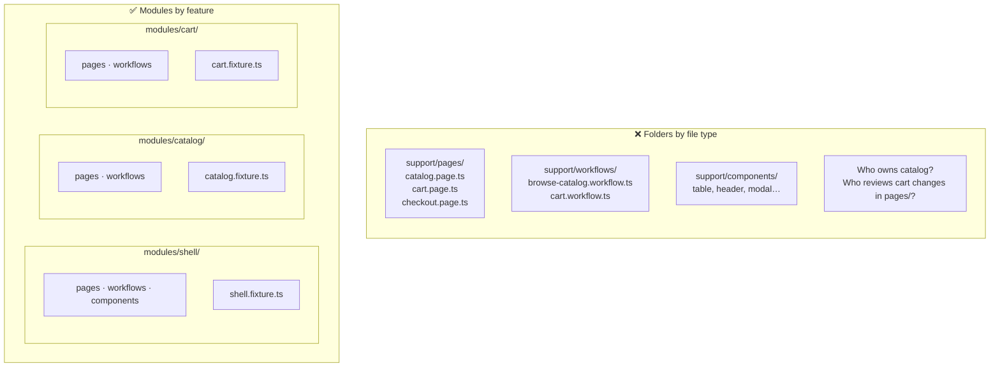
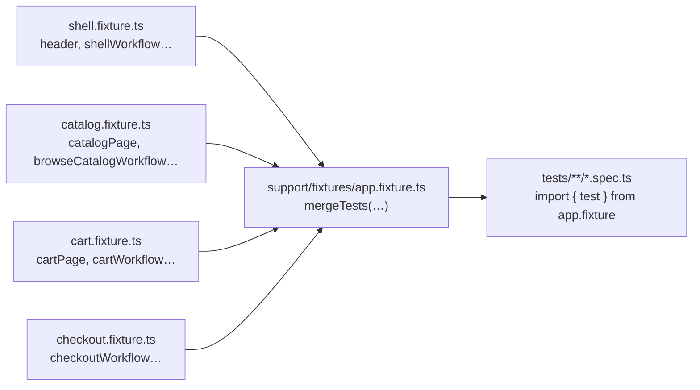
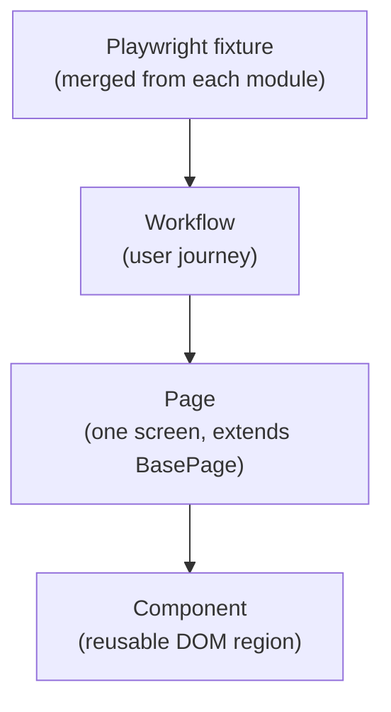
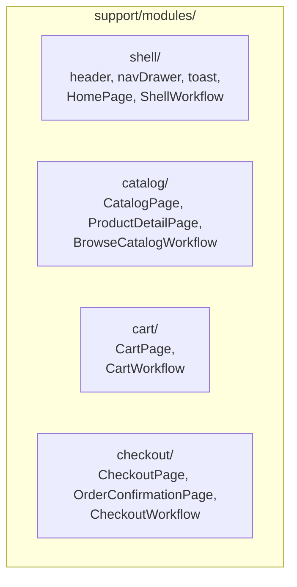

# Composition-first Playwright framework

An example repo for modern Playwright + TypeScript test architecture.


| Proposal                                     | In one sentence                                                                                     |
| -------------------------------------------- | --------------------------------------------------------------------------------------------------- |
| **Composition over inheritance**             | Pages and workflows are built by assembling small pieces — not by extending a deep class tree.      |
| **Modules over folders of files**            | Code is grouped by **product area** (Catalog, Cart…), not by **file type** (all pages in one pile). |
| **Fixtures composed from per-module slices** | Each team owns a small fixture file; the root **merges** them — no central 500-line fixture.        |
| **`test.step` instead of Cucumber glue**     | Given/When/Then lives in TypeScript; no feature files or regex step definitions.                    |


**Pitching this inside your company?** Read [Two proposals that scale with teams](#-two-proposals-that-scale-with-teams) first — that is the organizational model. Everything else (layers, lint rules, specs) supports it.

The whole repo is the artifact: folder tree, fixture wiring, and spec files are meant to be read.

## 🧱 Two proposals that scale with teams

Two organizing choices this repo bets on. Diagrams here; the deeper sections later cover the actual layout and code.

### Proposal 1 — Modules, not “all pages in one folder”

One folder = one product area = one team. Pages, workflows, and the module's fixture slice all live **inside** that folder, instead of being scattered across `pages/`, `workflows/`, `components/`.




→ See [📦 Module ownership](#-module-ownership) for the full folder tree and the CODEOWNERS map this folder shape gives you for free.

### Proposal 2 — Fixtures are merged slices, not one god file

**The problem on larger apps/teams:** the fixture file keeps growing. Every new page, workflow, or helper lands in the same `test.extend({...})` block. It becomes a multi-hundred-line file every team has to edit, a merge-conflict hotspot, and a place where unrelated modules quietly start depending on each other.

**Proposal:** each module's `*.fixture.ts` registers **only that module's** pages and workflows. The root `app.fixture.ts` does one thing: `mergeTests(shell, catalog, cart, checkout)`. Specs import a **single** `test` and get the union.




→ See [🔌 Fixtures: per-module, composed at the root](#-fixtures-per-module-composed-at-the-root) for the actual `catalog.fixture.ts` and `mergeTests` code. Adding a fifth product area is a new folder + one line in `mergeTests`.

Workflows stay inside their module; **only tests cross module boundaries**. That keeps modules independent and journey specs readable.

## 🎯 The claim

A test framework should make user behavior easier to express. If understanding a test requires opening five parent classes, tracing inheritance trees, and remembering hidden helpers, the framework is fighting maintainability.

Move from:

- framework-centric architecture
- inheritance-heavy design
- abstract layers disconnected from the UI

Toward:

- user-centric workflows
- domain-driven modules
- composition-based pages and components
- TypeScript-native orchestration
- explicit dependencies
- maintainable Playwright-first patterns

## 🏛️ Layer hierarchy




- **Fixtures** are dependency injection. Each module ships its own fixture file; the root fixture merges them.
- **Workflows** are user journeys. They are plain classes that compose pages in their constructor. No `BaseWorkflow`.
- **Pages** are one screen each. They extend `BasePage` (the only inheritance) and compose components in their constructor.
- **Components** are reusable DOM regions: header, nav drawer, table, modal, search box, qty stepper, toast.

## 🧩 Composition over inheritance

✖️ Avoid:

```
BasePage
  -> ShellBasePage
    -> CommerceBasePage
      -> CatalogPage
```

Hidden coupling, fragile parent dependencies, unclear ownership, framework-specific abstractions disconnected from the real UI.

✔️ Use:

```
BasePage  (tiny: page meta, marker, gotoPath, expectScreen)
  |
  +-- CatalogPage  (composes: HeaderComponent, NavDrawerComponent, SearchBoxComponent, TableComponent)
  +-- CartPage     (composes: HeaderComponent, NavDrawerComponent, TableComponent, QuantityStepperComponent)
  +-- CheckoutPage (composes: HeaderComponent, NavDrawerComponent)
```

Pages assemble what they need in their constructor. There is no shared subclass. The only inheritance in the repo is one level: `class XPage extends BasePage`.

Workflows are pure composition:

```ts
export class CheckoutWorkflow {
  readonly checkout: CheckoutPage;
  readonly confirmation: OrderConfirmationPage;
  constructor(page: Page) {
    this.checkout = new CheckoutPage(page);
    this.confirmation = new OrderConfirmationPage(page);
  }
}
```

## 📦 Module ownership

*See [Proposal 1 — Modules, not “all pages in one folder”](#proposal-1--modules-not-all-pages-in-one-folder) for the before/after picture.*

The mock app is a tiny e-commerce surface: a Shell hosts three feature modules. Each module is a self-contained team-owned slice — pages, workflows, and `*.fixture.ts` in one place.

**One URL, one owning team.** Each route has a single `*Page` class in the module that owns that screen’s product behavior. Other areas do not copy that class: they get there via their own workflows, shared shell/widgets, or a test that composes several fixtures.




Folder layout matches:

```
support/
  framework/                 # the only inheritable class lives here
    base.page.ts
    pom-marker.ts
  shared/components/         # truly cross-module atoms
    table | search-box | modal | quantity-stepper | product-card
  modules/
    shell/
      components/{header,nav-drawer,toast,featured-offers}.component.ts
      pages/home.page.ts
      workflows/{shell,membership}.workflow.ts
      shell.fixture.ts
    catalog/
      pages/{catalog,product-detail}.page.ts
      workflows/browse-catalog.workflow.ts
      catalog.fixture.ts
    cart/
      pages/cart.page.ts
      workflows/cart.workflow.ts
      cart.fixture.ts
    checkout/
      pages/{checkout,order-confirmation}.page.ts
      workflows/checkout.workflow.ts
      checkout.fixture.ts
  fixtures/
    app.fixture.ts           # mergeTests of every module fixture
  helpers/
    pom-visual.ts
tests/
  shell/        # shell-only behaviour
  catalog/      # catalog feature
  cart/         # cart feature
  checkout/     # checkout feature
```

A `CODEOWNERS` for this repo writes itself:

```
support/modules/shell/      @shell-team
support/modules/catalog/    @catalog-team
support/modules/cart/       @cart-team
support/modules/checkout/   @checkout-team
```

## 🔌 Fixtures: per-module, composed at the root

*See [Proposal 2 — Fixtures are merged slices](#proposal-2--fixtures-are-merged-slices-not-one-god-file) for the merge diagram.*

Each module owns its fixture file. Page fixtures (`catalogPage`, `cartPage`, …) and workflow fixtures (`browseCatalogWorkflow`, `cartWorkflow`, …) are registered together in that module — simple specs use a page, journey specs use a workflow. The root file only merges; it does not list every class.

```ts
// support/modules/catalog/catalog.fixture.ts
import { test as base } from "@playwright/test";

export const test = base.extend<CatalogFixtures>({
  catalogPage: async ({ page }, use) => use(new CatalogPage(page)),
  productDetailPage: async ({ page }, use) => use(new ProductDetailPage(page)),
  browseCatalogWorkflow: async ({ page }, use) => use(new BrowseCatalogWorkflow(page)),
});
```

The root fixture composes the four module slices with Playwright's `mergeTests`:

```ts
// support/fixtures/app.fixture.ts
import { mergeTests } from "@playwright/test";
import { test as shellTest } from "../modules/shell/shell.fixture";
import { test as catalogTest } from "../modules/catalog/catalog.fixture";
import { test as cartTest } from "../modules/cart/cart.fixture";
import { test as checkoutTest } from "../modules/checkout/checkout.fixture";

export const test = mergeTests(shellTest, catalogTest, cartTest, checkoutTest);
export { expect } from "@playwright/test";
```

Adding a new module is one folder and one line in `mergeTests`. Adding a new fixture is one entry in the owning module's file.

## 📏 Three sizes of test

The dimension that separates Simple / Medium / Complex is **what the test composes** — not how many steps it has. A two-line test can be complex; a fifteen-step test can still be medium.


| Tier    | What the test body composes                     | Module count | Fixture(s) used             |
| ------- | ----------------------------------------------- | ------------ | --------------------------- |
| Simple  | Nothing — uses one page directly                | 1            | `xPage`                     |
| Medium  | One workflow (it composes the pages internally) | 1            | `xWorkflow`                 |
| Complex | Multiple workflows from different modules       | 2+           | `xWorkflow`, `yWorkflow`, … |


The reason this hierarchy exists: workflows are pinned to their module by the boundaries lint rule, so **cross-module orchestration can only happen in a test**. The complex tier is the only place that composes more than one module — that, not "more steps", is what makes it complex.

### 🟢 Simple — page used directly

```ts
test("the shop lists the two seed products", async ({ catalogPage }) => {
  await catalogPage.goto();
  await catalogPage.expectProductListed("Acme Widget");
  await catalogPage.expectProductListed("Super Gizmo");
});
```

A page fixture is enough. No workflow. One module (catalog).

### 🟡 Medium — one workflow, one module

```ts
test("a buyer searches and opens a product", async ({ browseCatalogWorkflow }) => {
  await browseCatalogWorkflow.searchForProduct("Acme", "Acme Widget", "Super Gizmo");
  await browseCatalogWorkflow.openProductDetail("Acme Widget", "acme-widget");
});
```

The workflow owns the page composition. The test still touches **one** module — even when there are many steps. Adding more steps from the same module stays medium, no matter the length.

### 🔴 Complex — multiple workflows, multiple modules

```ts
test("a member completes a purchase across Catalog -> Cart -> Checkout", async ({
  shellWorkflow,
  membershipWorkflow,
  browseCatalogWorkflow,
  cartWorkflow,
  checkoutWorkflow,
  header,
  toast,
}) => {
  await shellWorkflow.openHome();
  await membershipWorkflow.switchToMember();

  await browseCatalogWorkflow.addProductToCart("Acme Widget", "acme-widget");
  await browseCatalogWorkflow.addProductToCart("Super Gizmo", "super-gizmo");
  await header.expectCartCount(2);

  await cartWorkflow.setQuantity("Acme Widget", 2);
  await cartWorkflow.proceedToCheckout();

  const orderNumber = await checkoutWorkflow.placeOrder({ saveCard: true });
  await toast.expectMessage(/Order placed/);
  test.expect(orderNumber).toMatch(/^ORD-\d{4}$/);
});
```

Four module-owned workflows used in one test: shell, catalog, cart, checkout — plus **`membershipWorkflow.switchToMember()`** up front so user type is explicit. Checkout uses `placeOrder({ saveCard: true })` for form behavior only, not identity. None of these workflows may import from a sibling module; cross-module journeys are assembled in the test.

## 📖 `test.step` vs Cucumber

The same complex test, rewritten with `test.step` for a Given/When/Then narrative without feature files or regex glue:

```ts
test("a member completes a purchase across Catalog -> Cart -> Checkout", async ({
  shellWorkflow,
  membershipWorkflow,
  browseCatalogWorkflow,
  cartWorkflow,
  checkoutWorkflow,
  header,
  toast,
}) => {
  await test.step("Given a member is on the store home", async () => {
    await shellWorkflow.openHome();
    await membershipWorkflow.switchToMember();
  });

  await test.step("When they add two products to the cart", async () => {
    await browseCatalogWorkflow.addProductToCart("Acme Widget", "acme-widget");
    await browseCatalogWorkflow.addProductToCart("Super Gizmo", "super-gizmo");
    await header.expectCartCount(2);
  });

  await test.step("And they raise the Acme Widget quantity to 2", async () => {
    await cartWorkflow.setQuantity("Acme Widget", 2);
  });

  await test.step("And they proceed to checkout and place the order with save card", async () => {
    await cartWorkflow.proceedToCheckout();
    const orderNumber = await checkoutWorkflow.placeOrder({ saveCard: true });
    test.expect(orderNumber).toMatch(/^ORD-\d{4}$/);
  });

  await test.step("Then a confirmation toast is visible", async () => {
    await toast.expectMessage(/Order placed/);
  });
});
```


| Concern                     | Cucumber / Gherkin         | `test.step`                         |
| --------------------------- | -------------------------- | ----------------------------------- |
| Step definitions            | Regex glue files           | Native TypeScript methods           |
| Navigation in IDE           | Across files               | Cmd+click to definition             |
| Refactor safety             | Manual sweep               | Compiler-checked                    |
| Conditional / dynamic steps | Awkward                    | Normal JS                           |
| Report narrative            | Step name in HTML          | Step name in HTML                   |
| Onboarding                  | Tool + DSL + feature files | One concept: `await test.step(...)` |


If business users actively maintain feature files, Cucumber may still be worth its cost. Otherwise `test.step` recovers the narrative without the rest of the framework drag.

## 🗺️ Where to put X


| Adding...                                        | Where it lives                                                    |
| ------------------------------------------------ | ----------------------------------------------------------------- |
| One screen, route-local behaviour                | New method on a **Page**                                          |
| A reusable dense UI (table, modal, picker)       | New **shared component** under `support/shared/components/`       |
| A reusable shell surface (header, drawer, toast) | New **shell component** under `support/modules/shell/components/` |
| A repeated user journey                          | New **workflow** in the owning module                             |
| A new feature module                             | New folder under `support/modules/<name>/` + line in `mergeTests` |
| Cross-module orchestration                       | In the **test**, by calling multiple workflows                    |


## ⚙️ Customizing the contract layer

Enforcement is intentionally a **minor suggestion**, not a manifesto. Two ESLint rules in `[eslint.config.mjs](eslint.config.mjs)`:

1. **Only `BasePage` may be extended in `support/modules/`.** Implemented with `no-restricted-syntax`. ~6 lines. Buys the "no inheritance pyramids" promise.
2. **Module isolation** via `eslint-plugin-boundaries`. Each module folder may import from `framework/`, `shared/`, `helpers/`, the shell module, or itself. Sibling feature modules are not importable. Adding a new module is three lines of config.

Both rules are commented in the config and removable in one edit. An org fork can also add stricter rules (forbid `page.locator(` in workflow specs, require file naming, ban barrels, etc.) by appending an `overrides` block — without touching framework code.

**What the framework deliberately does NOT enforce:**

- No required `static readonly meta` on workflows — folder + class name already document intent.
- No "spec must call a workflow" rule — implied by which fixtures the test pulls in.
- No "no raw `locator(` in specs" rule — see the counter-example below.
- No "workflow must end with an `expect`" rule — heuristic and brittle.
- No custom guardrail spec tests under `tests/framework/`.

### 🪧 Raw locator: teach, don't ban

`[tests/catalog/catalog-browse.raw.spec.ts](tests/catalog/catalog-browse.raw.spec.ts)` is a deliberate counter-example. It asserts the same simple case as `[catalog-browse.spec.ts](tests/catalog/catalog-browse.spec.ts)` but uses `page.locator(...)` and inline `expect`s. The framework does not stop you from going raw when you need to. The page-fixture version next to it is what we recommend. Pick by readability, not by rule.

## 🏷️ Selector and marker contract (convention only)

Selector priority in support-side POM code:

1. `getByRole`
2. `getByLabel`
3. `getByText`
4. `data-pom`
5. `data-testid` (last resort)

DOM marker contract:

- Page roots: `data-pom="pages/<screenId>"` — e.g. `pages/store.catalog`
- Shell component roots: `data-pom="components/shell/<componentName>"`
- Widget component roots: `data-pom="components/widgets/<componentName>"`

### Routes, titles, and page files (aligned)


| POM file                     | Route                           | `screenId`                 | Document title     |
| ---------------------------- | ------------------------------- | -------------------------- | ------------------ |
| `home.page.ts`               | `/`                             | `store.home`               | Home               |
| `catalog.page.ts`            | `/catalog/`                     | `store.catalog`            | Catalog            |
| `product-detail.page.ts`     | `/catalog/products/<slug>/`     | `store.product-detail`     | Product detail     |
| `cart.page.ts`               | `/cart/`                        | `store.cart`               | Cart               |
| `checkout.page.ts`           | `/checkout/`                    | `store.checkout`           | Checkout           |
| `order-confirmation.page.ts` | `/checkout/order-confirmation/` | `store.order-confirmation` | Order confirmation |


`screenId` uses the page file stem (kebab-case). Mock routes and folder names use the same stem so URL, filesystem, and POM line up in the inspector.

## ▶️ Run

- `npm install`
- `npm test`

Other scripts:

- `npm run test:ui` — Playwright UI mode
- `npm run test:headed`
- `npm run lint`
- `npm run typecheck`
- `npm run start:mock` — serve `mock-app/` on `http://127.0.0.1:4173/`
- `npm run start:mock:outlined` — same, with the floating POM inspector turned on
- `npm run test:outlined` / `:outlined:headed` / `:outlined:ui` — run the test suite with the POM inspector outlines pre-enabled (see below)

`playwright.config.ts` auto-starts `mock-app/` on `http://127.0.0.1:4173/` during test runs.

## 🔍 POM inspector

The mock ships with a floating "POM inspector" widget (bottom-right): toggle outlines on/off, see live lists of visible pages, shell components, and widgets. Configuration lives in `[mock-app/shared/pom-outline-config.json](mock-app/shared/pom-outline-config.json)`.

**Outline colors:** **blue** = shell (solid), **purple** = page (solid), **green** = widgets (dashed). Inspector panel uses the same three colors.

**Page tree:** each `<main data-pom="pages/…">` has `data-pom-composition` — widgets that page’s POM composes (including body-level UI like the home modal). Listed under **Page** with a `│` per widget; no separate widget section.

**Toast vs modal (where they live):** **Toast** = **shell** — one global surface, any module calls `mockStore.toast()`, fixed under the masthead (like app chrome). **Modal** = usually **page** (or feature) when the dialog is route-specific; home’s welcome modal is in `data-pom-composition` even though the DOM sits outside `<main>`. Both are body-level and `position: fixed`; only the **ownership** line differs.

Two ways to turn it on:

- **From the mock app**: `npm run start:mock:outlined` and click the FAB.
- **From a test run**: `npm run test:outlined` (or `:outlined:headed` / `:outlined:ui`).

The test-run toggle is **app initialization** — controlled by the `POM_VISUAL=1` environment variable read once in `[support/fixtures/app.fixture.ts](support/fixtures/app.fixture.ts)`. Specs never reference it. The root `test` extension adds one init script to each page when the env var is set; flip the var off and the surface disappears completely.

```ts
// support/fixtures/app.fixture.ts
export const test = merged.extend({
  page: async ({ page }, use) => {
    if (process.env.POM_VISUAL === "1") {
      await registerPomVisualOnPage(page);
    }
    await use(page);
  },
});
```

Selectors and assertions don't change when outlines are on, so a CI screenshot job can flip the flag without touching any spec.

## 🗂️ Test map


| Spec                                                                                   | Tier            | Focus                                                        |
| -------------------------------------------------------------------------------------- | --------------- | ------------------------------------------------------------ |
| `[tests/catalog/catalog-browse.spec.ts](tests/catalog/catalog-browse.spec.ts)`         | Simple + Medium | Page fixture, catalog workflow, toast on add-to-cart        |
| `[tests/catalog/membership-pricing.spec.ts](tests/catalog/membership-pricing.spec.ts)` | Complex         | Guest vs member prices (shell + catalog + cart)               |
| `[tests/catalog/catalog-browse.raw.spec.ts](tests/catalog/catalog-browse.raw.spec.ts)` | —               | Raw-locator counter-example                                  |
| `[tests/cart/cart.spec.ts](tests/cart/cart.spec.ts)`                                   | Medium          | Cart manipulation (cart workflow + catalog workflow seeding) |
| `[tests/checkout/checkout.purchase.spec.ts](tests/checkout/checkout.purchase.spec.ts)` | Complex         | Cross-module purchase journey (4 workflows in one test)      |
| `[tests/checkout/checkout.bdd.spec.ts](tests/checkout/checkout.bdd.spec.ts)`           | Complex         | Same journey rewritten with `test.step` Given/When/Then      |
| `[tests/shell/navigation.spec.ts](tests/shell/navigation.spec.ts)`                     | Medium          | Shell-only: greeting, offers, modal, drawer                  |

## 🤝 Tradeoffs (honest)

This layout is a set of **rules**, not convenience suggestions.

| Rule | What it buys you | What it costs |
| --- | --- | --- |
| **Modules do not import sibling modules** | Clear CODEOWNERS lines; no cart→catalog→checkout import webs | A journey that crosses areas is **wired in the test**, not hidden inside one “mega workflow” |
| **Workflows stay inside their module** | Each team owns journeys for its screens | Complex specs **must** pull several fixtures (`shellWorkflow`, `browseCatalogWorkflow`, `cartWorkflow`, …) — that verbosity is intentional |
| **One `*Page` class per route, one owning module** | No duplicate page objects or “who maintains `CheckoutPage`?” fights | Shared UI goes in **shell** or **`shared/components`**, not a second copy of a page class |
| **Root fixture = `mergeTests` only** | Adding a team’s surface does not edit everyone else’s fixture file | New module = new folder + one line in `mergeTests` (a deliberate onboarding step) |

**Cross-module tests are the integration layer.** ESLint blocks `catalog` from calling `cart` directly, so the only legal place to say “browse, then cart, then checkout” is the spec. That is why the purchase tests look “busy”: they are showing the **orchestration the architecture forbids elsewhere**.

**When two teams touch the same screen**, the framework does not split ownership — product does. Pick one module for the `*Page` file; other teams arrive via their workflows, shell/shared widgets, or a composed test. The diagrams stop where org charts start.

