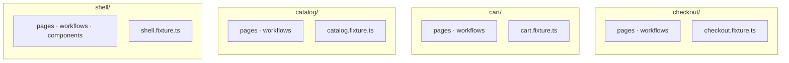
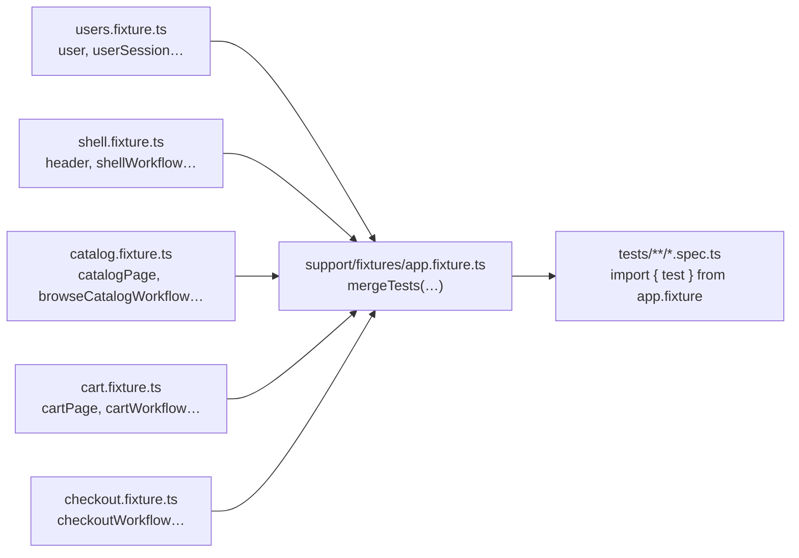
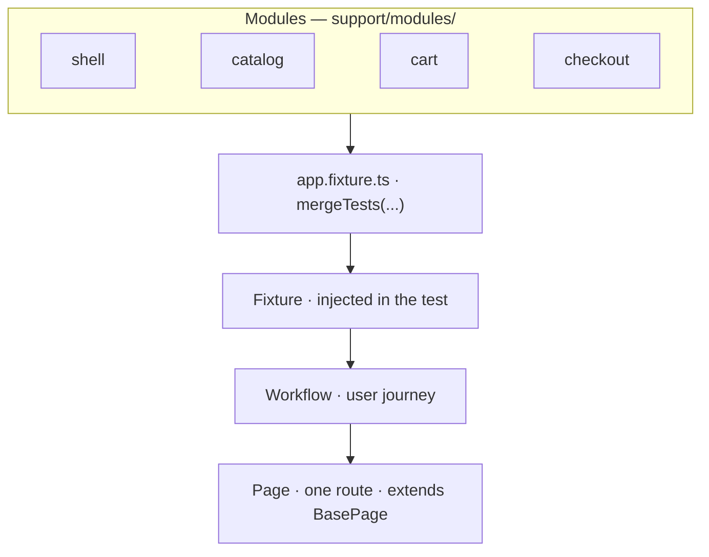
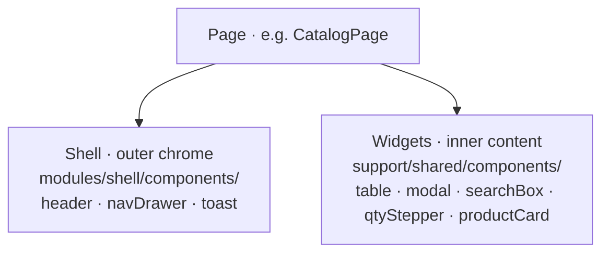
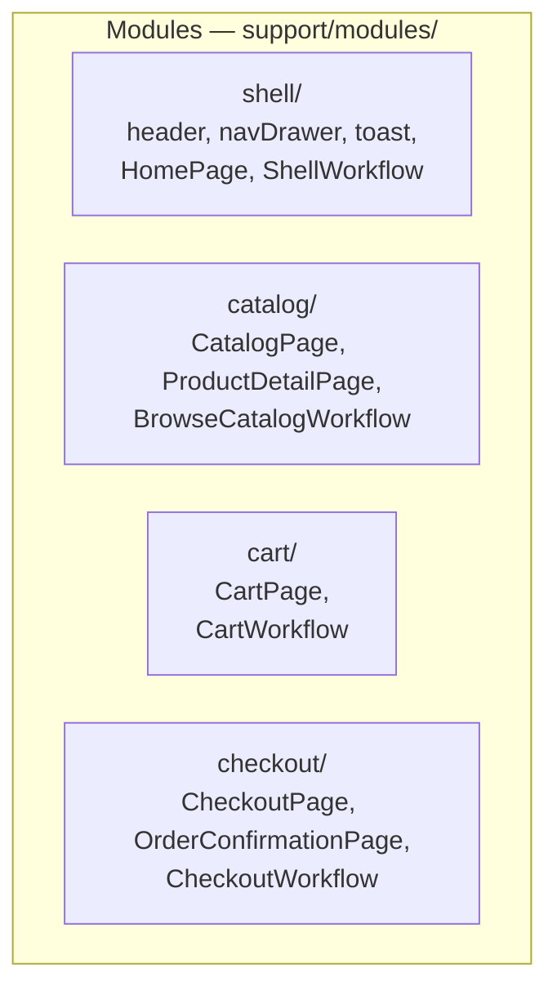

# Composition-first Playwright framework

An example repo for modern Playwright + TypeScript test architecture.


| Proposal                                     | In one sentence                                                                                     |
| -------------------------------------------- | --------------------------------------------------------------------------------------------------- |
| **Composition over inheritance**             | Pages and workflows are built by assembling small pieces — not by extending a deep class tree.      |
| **Modules over folders of files**            | Code is grouped by **product area** (Catalog, Cart…), not by **file type** (all pages in one pile). |
| **Fixtures composed from per-module slices** | Each team owns a small fixture file; the root **merges** them — no central 500-line fixture.        |
| **`test.step` instead of Cucumber glue**     | Given/When/Then lives in TypeScript; no feature files or regex step definitions.                    |


**Two proposals that scale with teams:** (1) **group code by product module** — each area owns its pages, workflows, and `*.fixture.ts` under `support/modules/<name>/`; (2) **merge fixtures at the root** — `app.fixture.ts` only calls `mergeTests(...)`, so teams do not share one giant fixture file. The rest of this README is how those two ideas show up in layers, lint, and specs.

## 🧱 Two proposals that scale with teams

### Proposal 1 — Modules, not “all pages in one folder”

One folder = one product area = one team. **Support code** (`support/modules/<feature>/`) holds that area’s pages, workflows, and `*.fixture.ts` together — not scattered across top-level `pages/`, `workflows/`, `components/` folders. Specs follow the same shape under `tests/<feature>/`, but Proposal 1 is about where **framework code** lives, not the test files themselves.

**❌ Folders by file type** — files grouped by *kind*, so every feature’s pages, workflows, and widgets sit in separate shared piles:

```text
support/
├── pages/           catalog.page, cart.page, checkout.page, …
├── workflows/       browse-catalog.workflow, cart.workflow, …
└── components/      table, header, modal, search-box, …

→ Who owns catalog? Who reviews cart changes in pages/?
```

**✅ Code by feature module** — each product area owns its own folder under `support/modules/`:

```text
support/modules/
├── shell/           pages/, workflows/, components/, shell.fixture.ts
├── catalog/         pages/, workflows/, catalog.fixture.ts
├── cart/            pages/, workflows/, cart.fixture.ts
└── checkout/        pages/, workflows/, checkout.fixture.ts
```




### Proposal 2 — Fixtures are merged slices, not one god file

**The problem on larger apps/teams:** the fixture file keeps growing. Every new page, workflow, or helper lands in the same `test.extend({...})` block. It becomes a multi-hundred-line file every team has to edit, a merge-conflict hotspot, and a place where unrelated modules quietly start depending on each other.

**Proposal:** each module's `*.fixture.ts` registers **only that module's** pages and workflows. The root `app.fixture.ts` does one thing: `mergeTests(users, shell, catalog, cart, checkout)`. Specs import a **single** `test` and get the union.




### What belongs inside a module (and what does not)

A module is a **team-owned boundary** in `support/modules/<name>/`:


| Inside the module                                                                                       | Outside the module                                                   |
| ------------------------------------------------------------------------------------------------------- | -------------------------------------------------------------------- |
| `pages/` for routes that area owns                                                                      | Another module’s `pages/` or `workflows/`                            |
| `workflows/` that compose **only** that module’s pages (plus `framework/`, `shared/`, `shell`, `users`) | `import` from a sibling feature module (catalog → cart is forbidden) |
| `components/` for UI that is specific to that area                                                      | Cross-area journeys written as one mega-workflow                     |
| `*.fixture.ts` registering that module’s pages and workflows                                            | —                                                                    |


**Tests are the only place that may compose multiple modules.** Example: a purchase spec calls `browseCatalogWorkflow`, `cartWorkflow`, and `checkoutWorkflow` in one file because ESLint blocks `catalog` from importing `cart`. That verbosity is intentional — it is the integration layer.

Workflows stay small and local; journey specs show how areas connect.

## 🎯 General Goal

A test framework should make user behavior easier to express. If understanding a test requires opening five parent classes, tracing inheritance trees, and remembering hidden helpers, the framework is fighting maintainability.

Move from:

- framework-centric architecture
- inheritance-heavy design
- abstract layers disconnected from the UI

Toward:

- user-centric workflows
- domain-driven modules
- composition-based pages and components
- TypeScript-native orchestration
- explicit dependencies
- maintainable Playwright-first patterns

## 🏛️ Layer hierarchy

**How a test run is wired** — modules supply fixture slices; the test uses fixtures (pages and/or workflows), not modules directly:




**What a page composes** — every page class assembles two layers of UI. **Shell components** are the outer app chrome (masthead, nav, toast): they wrap the route and look the same across the store. **Widget components** are the inner pieces on that screen’s content (table, modal, search box, stepper, product card): the page picks which widgets the route needs. Shell lives in the shell module; widgets live in `shared/` and any module may import them.




- **Modules** — team-owned folders (`catalog/`, `cart/`, `shell/`, `users/`, …). Each holds that area’s `pages/`, `workflows/`, optional `components/`, and `*.fixture.ts`. Sibling modules do not import each other.
- **Fixtures** — dependency injection. Each module registers its pages and workflows in its fixture file; `app.fixture.ts` merges them with `mergeTests`.
- **Workflows** — plain classes that compose pages in the constructor. No `BaseWorkflow`.
- **Pages** — one screen each; the only inheritance is `extends BasePage`. They assemble shell + widget components in the constructor.
- **Shell components** — app chrome shared across routes (masthead, nav drawer, toast). Live under `support/modules/shell/components/`.
- **Widget components** — dense reusable UI (table, modal, search box, quantity stepper, product card). Live under `support/shared/components/` and are imported by any module that needs them.

## 🧩 Composition over inheritance

✖️ Avoid:

```
BasePage
  -> ShellBasePage
    -> CommerceBasePage
      -> CatalogPage
```

Hidden coupling, fragile parent dependencies, unclear ownership, framework-specific abstractions disconnected from the real UI.

✔️ Use:

```
BasePage  (tiny: page meta, marker, gotoPath, expectScreen)
  |
  +-- CatalogPage  (composes: HeaderComponent, NavDrawerComponent, SearchBoxComponent, TableComponent)
  +-- CartPage     (composes: HeaderComponent, NavDrawerComponent, TableComponent, QuantityStepperComponent)
  +-- CheckoutPage (composes: HeaderComponent, NavDrawerComponent)
```

Pages assemble what they need in their constructor. There is no shared subclass. The only inheritance in the repo is one level: `class XPage extends BasePage`.

Workflows are pure composition:

```ts
export class CheckoutWorkflow {
  readonly checkout: CheckoutPage;
  readonly confirmation: OrderConfirmationPage;
  constructor(page: Page) {
    this.checkout = new CheckoutPage(page);
    this.confirmation = new OrderConfirmationPage(page);
  }
}
```

## 📦 Module ownership

The mock app is a tiny e-commerce surface: a Shell hosts three feature modules. Each module is a self-contained team-owned slice — pages, workflows, and `*.fixture.ts` in one place.

**One URL, one owning team.** Each route has a single `*Page` class in the module that owns that screen’s product behavior. Other areas do not copy that class: they get there via their own workflows, shared shell/widgets, or a test that composes several fixtures.




Folder layout matches:

```text
support/
├── framework/                    # only BasePage may be extended
│   ├── base.page.ts
│   └── pom-marker.ts
├── shared/
│   └── components/               # cross-module widgets
│       └── table, search-box, modal, quantity-stepper, product-card
├── modules/
│   ├── users/                    # journey user (fixture injection)
│   │   ├── user.model.ts
│   │   ├── user-session.ts
│   │   └── users.fixture.ts
│   ├── shell/
│   │   ├── components/           # header, nav-drawer, toast, featured-offers
│   │   ├── pages/home.page.ts
│   │   ├── workflows/            # shell, membership
│   │   └── shell.fixture.ts
│   ├── catalog/
│   │   ├── pages/                  # catalog, product-detail
│   │   ├── workflows/browse-catalog.workflow.ts
│   │   └── catalog.fixture.ts
│   ├── cart/
│   │   ├── pages/cart.page.ts
│   │   ├── workflows/cart.workflow.ts
│   │   └── cart.fixture.ts
│   └── checkout/
│       ├── pages/                  # checkout, order-confirmation
│       ├── workflows/checkout.workflow.ts
│       └── checkout.fixture.ts
├── fixtures/
│   └── app.fixture.ts              # mergeTests(...)
└── helpers/
    └── pom-visual.ts

tests/
├── users/
├── shell/
├── catalog/
├── cart/
└── checkout/
```

A `CODEOWNERS` for this repo writes itself:

```
support/modules/shell/      @shell-team
support/modules/catalog/    @catalog-team
support/modules/cart/       @cart-team
support/modules/checkout/   @checkout-team
```

## 🔌 Fixtures: per-module, composed at the root

Each module owns its fixture file. Page fixtures (`catalogPage`, `cartPage`, …) and workflow fixtures (`browseCatalogWorkflow`, `cartWorkflow`, …) are registered together in that module — simple specs use a page, journey specs use a workflow. The root file only merges; it does not list every class.

```ts
// support/modules/catalog/catalog.fixture.ts
import { test as base } from "@playwright/test";

export const test = base.extend<CatalogFixtures>({
  catalogPage: async ({ page }, use) => use(new CatalogPage(page)),
  productDetailPage: async ({ page }, use) => use(new ProductDetailPage(page)),
  browseCatalogWorkflow: async ({ page }, use) => use(new BrowseCatalogWorkflow(page)),
});
```

The root fixture composes every module slice with Playwright's `mergeTests` (`users` first so user seeding wraps `page`):

```ts
// support/fixtures/app.fixture.ts
import { mergeTests } from "@playwright/test";
import { test as usersTest } from "../modules/users/users.fixture";
import { test as shellTest } from "../modules/shell/shell.fixture";
import { test as catalogTest } from "../modules/catalog/catalog.fixture";
import { test as cartTest } from "../modules/cart/cart.fixture";
import { test as checkoutTest } from "../modules/checkout/checkout.fixture";

export const test = mergeTests(usersTest, shellTest, catalogTest, cartTest, checkoutTest);
export { expect } from "@playwright/test";
```

Adding a new product module is one folder and one line in `mergeTests`. Adding a new fixture is one entry in the owning module's file.

## 👤 Handling users

Every test should make clear **which user the journey starts with**. That is separate from switching membership mid-flow in the UI.


| Concern                                     | Where it lives                                                             |
| ------------------------------------------- | -------------------------------------------------------------------------- |
| **Starting user** (before first navigation) | `user` option fixture in `support/modules/users/` — like a session fixture |
| **Asserting who is active**                 | `userSession` (`expectActive`, `expectPersisted`)                          |
| **Changing tier mid-journey**               | `membershipWorkflow` in shell (masthead select)                            |


**Mock app:** the fixture seeds `localStorage` key `mock-store-membership` before any page load (same key the mock shell reads on boot). **Real app:** keep the same fixture slot; swap the implementation for cookies or an auth API call.

Default is `memberUser`. Override at the **top of the spec file** (worker-scoped option):

```ts
import { test } from "../../support/fixtures/app.fixture";
import { guestUser, memberUser } from "../../support/modules/users/user.model";

test.use({ user: guestUser });

test("starts as a guest and can become a member", async ({
  user,
  userSession,
  homePage,
  membershipWorkflow,
}) => {
  await homePage.goto();
  await userSession.expectActive(guestUser);
  await homePage.expectGreeting("GUEST");

  await membershipWorkflow.switchToMember();
  await userSession.expectActive(memberUser);
  await homePage.expectGreeting("MEMBER");
});
```

Teaching spec: `[tests/users/handling-users.spec.ts](tests/users/handling-users.spec.ts)`.

## 📏 Three sizes of test

The dimension that separates Simple / Medium / Complex is **what the test composes** — not how many steps it has. A two-line test can be complex; a fifteen-step test can still be medium.


| Tier    | What the test body composes                     | Module count | Fixture(s) used             |
| ------- | ----------------------------------------------- | ------------ | --------------------------- |
| Simple  | Nothing — uses one page directly                | 1            | `xPage`                     |
| Medium  | One workflow (it composes the pages internally) | 1            | `xWorkflow`                 |
| Complex | Multiple workflows from different modules       | 2+           | `xWorkflow`, `yWorkflow`, … |


The reason this hierarchy exists: workflows are pinned to their module by the boundaries lint rule, so **cross-module orchestration can only happen in a test**. The complex tier is the only place that composes more than one module — that, not "more steps", is what makes it complex.

### 🟢 Simple — page used directly

```ts
test("the shop lists the two seed products", async ({ catalogPage }) => {
  await catalogPage.goto();
  await catalogPage.expectProductListed("Acme Widget");
  await catalogPage.expectProductListed("Super Gizmo");
});
```

A page fixture is enough. No workflow. One module (catalog).

### 🟡 Medium — one workflow, one module

```ts
test("a buyer searches and opens a product", async ({ browseCatalogWorkflow }) => {
  await browseCatalogWorkflow.searchForProduct("Acme", "Acme Widget", "Super Gizmo");
  await browseCatalogWorkflow.openProductDetail("Acme Widget", "acme-widget");
});
```

The workflow owns the page composition. The test still touches **one** module — even when there are many steps. Adding more steps from the same module stays medium, no matter the length.

### 🔴 Complex — multiple workflows, multiple modules

```ts
test("a member completes a purchase across Catalog -> Cart -> Checkout", async ({
  shellWorkflow,
  membershipWorkflow,
  browseCatalogWorkflow,
  cartWorkflow,
  checkoutWorkflow,
  header,
  toast,
}) => {
  await shellWorkflow.openHome();
  await membershipWorkflow.switchToMember();

  await browseCatalogWorkflow.addProductToCart("Acme Widget", "acme-widget");
  await browseCatalogWorkflow.addProductToCart("Super Gizmo", "super-gizmo");
  await header.expectCartCount(2);

  await cartWorkflow.setQuantity("Acme Widget", 2);
  await cartWorkflow.proceedToCheckout();

  const orderNumber = await checkoutWorkflow.placeOrder({ saveCard: true });
  await toast.expectMessage(/Order placed/);
  test.expect(orderNumber).toMatch(/^ORD-\d{4}$/);
});
```

Four module-owned workflows used in one test: shell, catalog, cart, checkout — plus `membershipWorkflow.switchToMember()` so the journey acts as a member (or `test.use({ user: memberUser })` at file top; see **Handling users**). Checkout uses `placeOrder({ saveCard: true })` for form behavior only, not identity. None of these workflows may import from a sibling module; cross-module journeys are assembled in the test.

## 📖 `test.step` vs Cucumber

The same complex test, rewritten with `test.step` for a Given/When/Then narrative without feature files or regex glue:

```ts
test("a member completes a purchase across Catalog -> Cart -> Checkout", async ({
  shellWorkflow,
  membershipWorkflow,
  browseCatalogWorkflow,
  cartWorkflow,
  checkoutWorkflow,
  header,
  toast,
}) => {
  await test.step("Given a member is on the store home", async () => {
    await shellWorkflow.openHome();
    await membershipWorkflow.switchToMember();
  });

  await test.step("When they add two products to the cart", async () => {
    await browseCatalogWorkflow.addProductToCart("Acme Widget", "acme-widget");
    await browseCatalogWorkflow.addProductToCart("Super Gizmo", "super-gizmo");
    await header.expectCartCount(2);
  });

  await test.step("And they raise the Acme Widget quantity to 2", async () => {
    await cartWorkflow.setQuantity("Acme Widget", 2);
  });

  await test.step("And they proceed to checkout and place the order with save card", async () => {
    await cartWorkflow.proceedToCheckout();
    const orderNumber = await checkoutWorkflow.placeOrder({ saveCard: true });
    test.expect(orderNumber).toMatch(/^ORD-\d{4}$/);
  });

  await test.step("Then a confirmation toast is visible", async () => {
    await toast.expectMessage(/Order placed/);
  });
});
```


| Concern                     | Cucumber / Gherkin         | `test.step`                         |
| --------------------------- | -------------------------- | ----------------------------------- |
| Step definitions            | Regex glue files           | Native TypeScript methods           |
| Navigation in IDE           | Across files               | Cmd+click to definition             |
| Refactor safety             | Manual sweep               | Compiler-checked                    |
| Conditional / dynamic steps | Awkward                    | Normal JS                           |
| Report narrative            | Step name in HTML          | Step name in HTML                   |
| Onboarding                  | Tool + DSL + feature files | One concept: `await test.step(...)` |


If business users actively maintain feature files, Cucumber may still be worth its cost. Otherwise `test.step` recovers the narrative without the rest of the framework drag.

## 🗺️ Where to put X


| Adding...                                        | Where it lives                                                                                               |
| ------------------------------------------------ | ------------------------------------------------------------------------------------------------------------ |
| A new screen (page + mock route)                 | `support/modules/<module>/pages/<name>.page.ts` + `mock-app/<route>/` (same stem — **Locators and screens**) |
| One screen, route-local behaviour                | New method on a **Page**                                                                                     |
| A reusable dense UI (table, modal, picker)       | New **shared component** under `support/shared/components/`                                                  |
| A reusable shell surface (header, drawer, toast) | New **shell component** under `support/modules/shell/components/`                                            |
| A repeated user journey                          | New **workflow** in the owning module                                                                        |
| A new feature module                             | New folder under `support/modules/<name>/` + line in `mergeTests`                                            |
| Starting user / session bootstrap                | `test.use({ user: guestUser })` + `users.fixture.ts` (**Handling users** section)                            |
| Cross-module orchestration                       | In the **test**, by calling multiple workflows                                                               |


## ⚙️ Customizing the contract layer

Enforcement is intentionally a **minor suggestion**, not a manifesto. Two ESLint rules in `[eslint.config.mjs](eslint.config.mjs)`:

1. **Only `BasePage` may be extended in `support/modules/`.** Implemented with `no-restricted-syntax`. ~6 lines. Buys the "no inheritance pyramids" promise.
2. **Module isolation** via `eslint-plugin-boundaries`. Each module folder may import from `framework/`, `shared/`, `helpers/`, the `users` module, the shell module, or itself. Sibling feature modules are not importable. Adding a new product module is three lines of config.

Both rules are commented in the config and removable in one edit. An org fork can also add stricter rules (forbid `page.locator(` in workflow specs, require file naming, ban barrels, etc.) by appending an `overrides` block — without touching framework code.

`tests/catalog/catalog-browse.raw.spec.ts` is a deliberate counter-example: same assertion as `catalog-browse.spec.ts`, but with raw `page.locator` calls. The framework does not ban that escape hatch; the page-fixture version is what we recommend.

## 🏷️ Locators and screens

**Locators** — in pages and components, use Playwright’s accessible queries only: `getByRole`, then `getByLabel`, then `getByText`. Pages call component methods; components own any trickier DOM inside the widget.

```ts
// catalog.page.ts — page level
await this.table.expectRowVisible("Acme Widget");
await this.table.clickRowAction("Acme Widget", "View");
```

```ts
// table.component.ts — inside the widget
this.tableRoot.getByRole("row").filter({ hasText: rowText });
this.tableRoot.getByRole("columnheader", { name: "PRICE" });
```

**Screens** — one `*.page.ts` per route under `support/modules/<module>/pages/`. File stem is the shared key for `screenId`, URL, and mock folder.

```ts
// support/modules/catalog/pages/catalog.page.ts
super(page, {
  screenId: "store.catalog",
  pathname: "/catalog",
  documentTitle: "Catalog",
});
```

```txt
mock-app/catalog/index.html  →  /catalog/
```

New screens and other artifacts: see **Where to put X** above.

## ▶️ Run

- `npm install`
- `npm test`

Other scripts:

- `npm run test:ui` — Playwright UI mode
- `npm run test:headed`
- `npm run lint`
- `npm run typecheck`
- `npm run start:mock` — serve `mock-app/` on `http://127.0.0.1:4173/`
- `npm run start:mock:outlined` — same, with the floating POM inspector turned on
- `npm run test:outlined` / `:outlined:headed` / `:outlined:ui` — run the test suite with the POM inspector outlines pre-enabled (see below)

`playwright.config.ts` auto-starts `mock-app/` on `http://127.0.0.1:4173/` during test runs.

## 🔍 POM inspector

The mock ships with a floating "POM inspector" widget (bottom-right): toggle outlines on/off, see live lists of visible pages, shell components, and widgets, and open **[README](/readme/)** (project docs rendered from this file — not a store page). Configuration lives in `[mock-app/shared/pom-outline-config.json](mock-app/shared/pom-outline-config.json)`.

**Outline colors:** **blue** = shell (solid), **purple** = page (solid), **green** = widgets (dashed). Inspector panel uses the same three colors.

**Page tree:** each `<main data-pom="pages/…">` has `data-pom-composition` — widgets that page’s POM composes (including body-level UI like the home modal). Listed under **Page** with a `│` per widget; no separate widget section.

Two ways to turn it on:

- **From the mock app**: `npm run start:mock:outlined` and click the FAB.
- **From a test run**: `npm run test:outlined` (or `:outlined:headed` / `:outlined:ui`).

The test-run toggle is **app initialization** — controlled by the `POM_VISUAL=1` environment variable read once in `[support/fixtures/app.fixture.ts](support/fixtures/app.fixture.ts)`. Specs never reference it. The root `test` extension adds one init script to each page when the env var is set; flip the var off and the surface disappears completely.

```ts
// support/fixtures/app.fixture.ts
export const test = merged.extend({
  page: async ({ page }, use) => {
    if (process.env.POM_VISUAL === "1") {
      await registerPomVisualOnPage(page);
    }
    await use(page);
  },
});
```

Selectors and assertions don't change when outlines are on, so a CI screenshot job can flip the flag without touching any spec.

## 🗂️ Test map


| Spec                                                                                   | Tier            | Focus                                                              |
| -------------------------------------------------------------------------------------- | --------------- | ------------------------------------------------------------------ |
| `[tests/catalog/catalog-browse.spec.ts](tests/catalog/catalog-browse.spec.ts)`         | Simple + Medium | Page fixture, catalog workflow, toast on add-to-cart               |
| `[tests/catalog/membership-pricing.spec.ts](tests/catalog/membership-pricing.spec.ts)` | Complex         | Guest vs member prices (shell + catalog + cart)                    |
| `[tests/catalog/catalog-browse.raw.spec.ts](tests/catalog/catalog-browse.raw.spec.ts)` | —               | Raw-locator counter-example                                        |
| `[tests/cart/cart.spec.ts](tests/cart/cart.spec.ts)`                                   | Medium          | Cart manipulation (cart workflow + catalog workflow seeding)       |
| `[tests/checkout/checkout.purchase.spec.ts](tests/checkout/checkout.purchase.spec.ts)` | Complex         | Cross-module purchase journey (4 workflows in one test)            |
| `[tests/checkout/checkout.bdd.spec.ts](tests/checkout/checkout.bdd.spec.ts)`           | Complex         | Same journey rewritten with `test.step` Given/When/Then            |
| `[tests/shell/navigation.spec.ts](tests/shell/navigation.spec.ts)`                     | Medium          | Shell-only: greeting, offers, modal, drawer                        |
| `[tests/users/handling-users.spec.ts](tests/users/handling-users.spec.ts)`             | Medium          | Starting user (`user` fixture) vs mid-journey `membershipWorkflow` |


## 🤝 Tradeoffs

This layout is a set of **rules**, not convenience suggestions.


| Rule                                               | What it buys you                                                    | What it costs                                                                                                                              |
| -------------------------------------------------- | ------------------------------------------------------------------- | ------------------------------------------------------------------------------------------------------------------------------------------ |
| **Modules do not import sibling modules**          | Clear CODEOWNERS lines; no cart→catalog→checkout import webs        | A journey that crosses areas is **wired in the test**, not hidden inside one “mega workflow”                                               |
| **Workflows stay inside their module**             | Each team owns journeys for its screens                             | Complex specs **must** pull several fixtures (`shellWorkflow`, `browseCatalogWorkflow`, `cartWorkflow`, …) — that verbosity is intentional |
| **One `*Page` class per route, one owning module** | No duplicate page objects or “who maintains `CheckoutPage`?” fights | Shared UI goes in **shell** or **`shared/components`**, not a second copy of a page class                                                  |
| **Root fixture = `mergeTests` only**               | Adding a team’s surface does not edit everyone else’s fixture file  | New module = new folder + one line in `mergeTests` (a deliberate onboarding step)                                                          |


**Cross-module tests are the integration layer.** ESLint blocks `catalog` from calling `cart` directly, so the only legal place to say “browse, then cart, then checkout” is the spec. That is why the purchase tests look “busy”: they are showing the **orchestration the architecture forbids elsewhere**.

**When two teams touch the same screen**, the framework does not split ownership — product does. Pick one module for the `*Page` file; other teams arrive via their workflows, shell/shared widgets, or a composed test. The diagrams stop where org charts start.