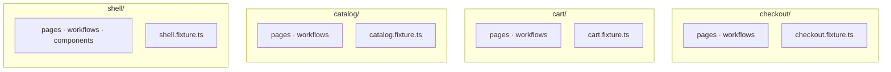
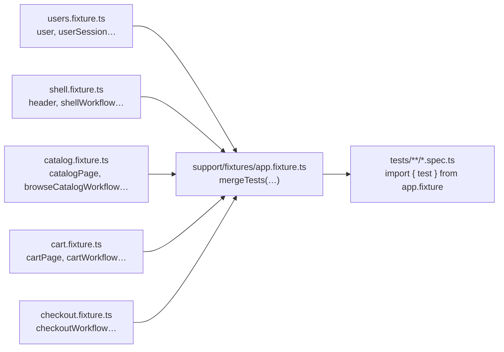
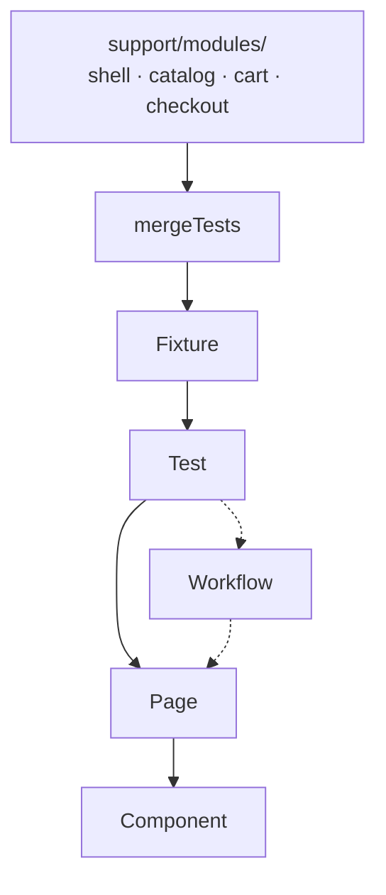
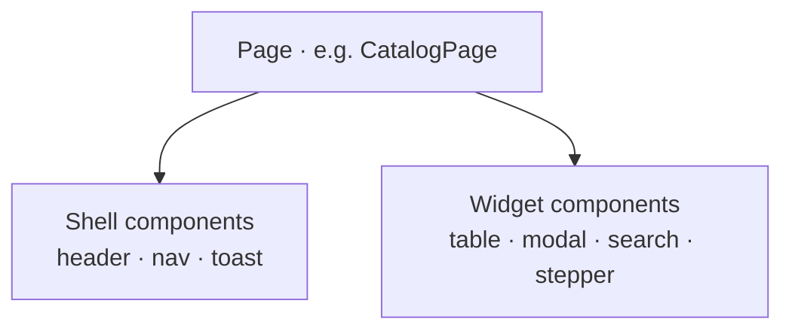

# Composition-first Playwright framework

An example repo for modern Playwright + TypeScript test architecture.


| Proposal                                     | In one sentence                                                                                     |
| -------------------------------------------- | --------------------------------------------------------------------------------------------------- |
| **Composition over inheritance**             | Pages and workflows are built by assembling small pieces — not by extending a deep class tree.      |
| **Modules over folders of files**            | Code is grouped by **product area** (Catalog, Cart…), not by **file type** (all pages in one pile). |
| **Fixtures composed from per-module slices** | Each team owns a small fixture file; the root **merges** them — no central 500-line fixture.        |
| `**test.step` instead of Cucumber glue**     | Given/When/Then lives in TypeScript; no feature files or regex step definitions.                    |


**Two proposals that scale with teams:** (1) **group code by product module** — each area owns its pages, workflows, and `*.fixture.ts` under `support/modules/<name>/`; (2) **merge fixtures at the root** — `app.fixture.ts` only calls `mergeTests(...)`, so teams do not share one giant fixture file. The rest of this README is how those two ideas show up in layers, lint, and specs.

## 🧱 Two proposals that scale with teams

### Proposal 1 — Modules, not “all pages in one folder”

One folder = one product area = one team. **Support code** (`support/modules/<feature>/`) holds that area’s pages, workflows, and `*.fixture.ts` together.

**❌ Folders by file type** — files grouped by *kind*, so every feature’s pages, workflows, and widgets sit in separate shared piles:

```text
support/
├── pages/           catalog.page, cart.page, checkout.page, …
├── workflows/       browse-catalog.workflow, cart.workflow, …
└── components/      table, header, modal, search-box, …

→ Who owns catalog? Who reviews cart changes in pages/?
```

**✅ Code by feature module** — each product area owns its own folder under `support/modules/`:

```text
support/modules/
├── shell/           pages/, workflows/, components/, shell.fixture.ts
├── catalog/         pages/, workflows/, catalog.fixture.ts
├── cart/            pages/, workflows/, cart.fixture.ts
└── checkout/        pages/, workflows/, checkout.fixture.ts
```




### Proposal 2 — Fixtures are merged slices, not one god file

One giant `test.extend({...})` becomes a merge-conflict magnet. Each module’s `*.fixture.ts` registers **only its** pages/workflows; root `app.fixture.ts` only `mergeTests(...)`.




### What belongs inside a module (and what does not)

A module is a **team-owned boundary** in `support/modules/<name>/`:


| Inside the module                                                                                       | Outside the module                                                   |
| ------------------------------------------------------------------------------------------------------- | -------------------------------------------------------------------- |
| `pages/` for routes that area owns                                                                      | Another module’s `pages/` or `workflows/`                            |
| `workflows/` that compose **only** that module’s pages (plus `framework/`, `shared/`, `shell`, `users`) | `import` from a sibling feature module (catalog → cart is forbidden) |
| `components/` for UI that is specific to that area                                                      | Cross-area journeys as one mega-workflow (belongs in `tests/`)       |
| `*.fixture.ts` registering that module’s pages and workflows                                            | —                                                                    |


Layer rules (workflows stay in-module; tests may compose several fixtures) → **Layer hierarchy** and **Three sizes of test**.

## 🎯 General Goal

Tests should read like user behavior, not archaeology through inheritance trees. This repo favors **modules**, **composition**, and **TypeScript** orchestration in specs.

## 🏛️ Layer hierarchy

**How a test run is wired** — modules supply fixture slices; the test uses fixtures (pages and/or workflows), not modules directly:




**Workflow** is optional. Test composition flows **down** this stack, never sideways into another feature module.


| Layer         | Lives in                                    | Composes                                                                                 | Does not                                                          |
| ------------- | ------------------------------------------- | ---------------------------------------------------------------------------------------- | ----------------------------------------------------------------- |
| **Component** | `shared/components/` or `shell/components/` | Locators inside that widget                                                              | Other modules, routes, or journeys                                |
| **Page**      | `modules/<feature>/pages/`                  | Shell + widget components for **one screen**                                             | Pages or workflows from another module                            |
| **Workflow**  | `modules/<feature>/workflows/`              | **That module’s pages only**                                                             | Sibling module pages, workflows, or whole-app journeys            |
| **Fixture**   | `modules/<feature>/*.fixture.ts`            | That module’s pages and workflows                                                        | Another module’s classes                                          |
| **Test**      | `tests/`                                    | Any merged fixtures in one spec — **several workflows when the journey crosses modules** | Importing or calling another module’s workflows from support code |


A **workflow** composes only that module’s pages and must not import another feature’s pages or workflows. A **spec** may use multiple workflow fixtures together (`browseCatalogWorkflow`, `cartWorkflow`, …). See **Three sizes of test**.

**What a page composes:** **shell** (header, nav, toast — `shell/components/`) + **widgets** (table, modal, search — `shared/components/`).




## 🧩 Composition over inheritance

✖️ Avoid:

```
BasePage
  -> ShellBasePage
    -> CommerceBasePage
      -> CatalogPage
```

Hidden coupling, fragile parent dependencies, unclear ownership, framework-specific abstractions disconnected from the real UI.

✔️ Use:

```
BasePage  (tiny: page meta, marker, gotoPath, expectScreen)
  |
  +-- CatalogPage  (composes: HeaderComponent, NavDrawerComponent, SearchBoxComponent, TableComponent)
  +-- CartPage     (composes: HeaderComponent, NavDrawerComponent, TableComponent, QuantityStepperComponent)
  +-- CheckoutPage (composes: HeaderComponent, NavDrawerComponent)
```

Pages and workflows assemble collaborators in the constructor — no shared subclass beyond `BasePage`.

## 📦 Module ownership

Each **mock route** has one **owning module**. That module holds the `*Page` for that screen and any **workflow** that only touches those pages. Shell surfaces (header, nav, toast) live in `shell/` and are composed into every page — they are not “owned” by catalog or cart.


| Route                          | Owner       | Page / workflow                        |
| ------------------------------ | ----------- | -------------------------------------- |
| `/`                            | `shell/`    | `HomePage`, `ShellWorkflow`            |
| `/catalog`                     | `catalog/`  | `CatalogPage`, `BrowseCatalogWorkflow` |
| `/catalog/products/:slug`      | `catalog/`  | `ProductDetailPage`                    |
| `/cart`                        | `cart/`     | `CartPage`, `CartWorkflow`             |
| `/checkout`                    | `checkout/` | `CheckoutPage`, `CheckoutWorkflow`     |
| `/checkout/order-confirmation` | `checkout/` | `OrderConfirmationPage`                |


**Leaving a module** — same-module workflow, shell navigation, or a **test** that composes several workflow fixtures. Never copy another module’s `*Page` into your folder.

```text
support/modules/
├── shell/       pages/, workflows/, components/ (frame), shell.fixture.ts
├── catalog/     pages/, workflows/, catalog.fixture.ts
├── cart/         pages/, workflows/, cart.fixture.ts
└── checkout/     pages/, workflows/, checkout.fixture.ts

support/framework/   BasePage only
support/shared/      widgets (table, modal, search, …)
support/modules/users/   user fixture (not a product screen)
support/fixtures/app.fixture.ts   mergeTests(...)
```

A `CODEOWNERS` for this repo writes itself:

```
support/modules/shell/      @shell-team
support/modules/catalog/    @catalog-team
support/modules/cart/       @cart-team
support/modules/checkout/   @checkout-team
```

## 🔌 Fixtures: per-module, composed at the root

Each `*.fixture.ts` registers that module’s pages and workflows. Root file only merges (`users` first so seeding wraps `page`):

```ts
// support/fixtures/app.fixture.ts
import { mergeTests } from "@playwright/test";
import { test as usersTest } from "../modules/users/users.fixture";
import { test as shellTest } from "../modules/shell/shell.fixture";
import { test as catalogTest } from "../modules/catalog/catalog.fixture";
import { test as cartTest } from "../modules/cart/cart.fixture";
import { test as checkoutTest } from "../modules/checkout/checkout.fixture";

export const test = mergeTests(usersTest, shellTest, catalogTest, cartTest, checkoutTest);
export { expect } from "@playwright/test";
```

Adding a new product module is one folder and one line in `mergeTests`. Adding a new fixture is one entry in the owning module's file.

## 👤 Handling users

Every test should make clear **which user the journey starts with**. That is separate from switching membership mid-flow in the UI.


| Concern                                     | Where it lives                                                             |
| ------------------------------------------- | -------------------------------------------------------------------------- |
| **Starting user** (before first navigation) | `user` option fixture in `support/modules/users/` — like a session fixture |
| **Asserting who is active**                 | `userSession` (`expectActive`, `expectPersisted`)                          |
| **Changing tier mid-journey**               | `membershipWorkflow` in shell (masthead select)                            |


**Mock app:** seeds `localStorage` `mock-store-membership` before load. **Real app:** same fixture slot; swap for cookies/API. Default `memberUser`; override with `test.use({ user: guestUser })` at file top.

Spec: `[tests/users/handling-users.spec.ts](tests/users/handling-users.spec.ts)`.

## 📏 Three sizes of test

Tier = **what fixtures the spec composes**, not step count. **Complex** specs call multiple workflows in one test; each workflow still only wraps pages from its own module.


| Tier    | Spec uses                     | Example spec                                                                     |
| ------- | ----------------------------- | -------------------------------------------------------------------------------- |
| Simple  | `xPage`                       | `[catalog-browse.spec.ts](tests/catalog/catalog-browse.spec.ts)` (list products) |
| Medium  | one `xWorkflow`               | same file (search + open product)                                                |
| Complex | workflows from **2+ modules** | `[checkout.purchase.spec.ts](tests/checkout/checkout.purchase.spec.ts)`          |


## 📖 `test.step` vs Cucumber

Same complex journey with narrative steps — `[checkout.bdd.spec.ts](tests/checkout/checkout.bdd.spec.ts)`:

```ts
await test.step("Given a member is on the store home", async () => {
  await shellWorkflow.openHome();
  await membershipWorkflow.switchToMember();
});
```


| Concern                     | Cucumber / Gherkin         | `test.step`                         |
| --------------------------- | -------------------------- | ----------------------------------- |
| Step definitions            | Regex glue files           | Native TypeScript methods           |
| Navigation in IDE           | Across files               | Cmd+click to definition             |
| Refactor safety             | Manual sweep               | Compiler-checked                    |
| Conditional / dynamic steps | Awkward                    | Normal JS                           |
| Report narrative            | Step name in HTML          | Step name in HTML                   |
| Onboarding                  | Tool + DSL + feature files | One concept: `await test.step(...)` |


If business users actively maintain feature files, Cucumber may still be worth its cost. Otherwise `test.step` recovers the narrative without the rest of the framework drag.

## 🗺️ Where to put X


| Adding...                                        | Where it lives                                                                                               |
| ------------------------------------------------ | ------------------------------------------------------------------------------------------------------------ |
| A new screen (page + mock route)                 | `support/modules/<module>/pages/<name>.page.ts` + `mock-app/<route>/` (same stem — **Locators and screens**) |
| One screen, route-local behaviour                | New method on a **Page**                                                                                     |
| A reusable dense UI (table, modal, picker)       | New **shared component** under `support/shared/components/`                                                  |
| A reusable shell surface (header, drawer, toast) | New **shell component** under `support/modules/shell/components/`                                            |
| A repeated user journey                          | New **workflow** in the owning module                                                                        |
| A new feature module                             | New folder under `support/modules/<name>/` + line in `mergeTests`                                            |
| Starting user / session bootstrap                | `test.use({ user: guestUser })` + `users.fixture.ts` (**Handling users** section)                            |
| Journey across modules                           | The **spec** — call multiple workflow fixtures (not one workflow importing another module)                   |


## ⚙️ Customizing the contract layer

Enforcement is intentionally a **minor suggestion**, not a manifesto. Two ESLint rules in `[eslint.config.mjs](eslint.config.mjs)`:

1. **Only `BasePage` may be extended in `support/modules/`.** Implemented with `no-restricted-syntax`. ~6 lines. Buys the "no inheritance pyramids" promise.
2. **Module isolation** via `eslint-plugin-boundaries`. Each module folder may import from `framework/`, `shared/`, `helpers/`, the `users` module, the shell module, or itself. Sibling feature modules are not importable. Adding a new product module is three lines of config.

Both rules are commented in the config and removable in one edit. An org fork can also add stricter rules (forbid `page.locator(` in workflow specs, require file naming, ban barrels, etc.) by appending an `overrides` block — without touching framework code.

`tests/catalog/catalog-browse.raw.spec.ts` is a deliberate counter-example: same assertion as `catalog-browse.spec.ts`, but with raw `page.locator` calls. The framework does not ban that escape hatch; the page-fixture version is what we recommend.

## 🏷️ Locators and screens

**Locators** — in pages and components, use Playwright’s accessible queries only: `getByRole`, then `getByLabel`, then `getByText`. Pages call component methods; components own any trickier DOM inside the widget.

```ts
// catalog.page.ts — page level
await this.table.expectRowVisible("Acme Widget");
await this.table.clickRowAction("Acme Widget", "View");
```

```ts
// table.component.ts — inside the widget
this.tableRoot.getByRole("row").filter({ hasText: rowText });
this.tableRoot.getByRole("columnheader", { name: "PRICE" });
```

**Screens** — one `*.page.ts` per route under `support/modules/<module>/pages/`. File stem is the shared key for `screenId`, URL, and mock folder.

```ts
// support/modules/catalog/pages/catalog.page.ts
super(page, {
  screenId: "store.catalog",
  pathname: "/catalog",
  documentTitle: "Catalog",
});
```

```txt
mock-app/catalog/index.html  →  /catalog/
```

New screens and other artifacts: see **Where to put X** above.

## ▶️ Run

- `npm install`
- `npm test`

Other scripts:

- `npm run test:ui` — Playwright UI mode
- `npm run test:headed`
- `npm run lint`
- `npm run typecheck`
- `npm run start:mock` — serve `mock-app/` on `http://127.0.0.1:4173/`
- `npm run start:mock:outlined` — same, with the floating POM inspector turned on
- `npm run test:outlined` / `:outlined:headed` / `:outlined:ui` — run the test suite with the POM inspector outlines pre-enabled (see below)

`playwright.config.ts` auto-starts `mock-app/` on `http://127.0.0.1:4173/` during test runs.

## 🔍 POM inspector

The mock ships with a floating "POM inspector" widget (bottom-right): toggle outlines on/off, see live lists of visible pages, shell components, and widgets, and open **[README](/readme/)** (project docs rendered from this file — not a store page). Configuration lives in `[mock-app/shared/pom-outline-config.json](mock-app/shared/pom-outline-config.json)`.

**Outline colors:** **blue** = shell (solid), **purple** = page (solid), **green** = widgets (dashed). Inspector panel uses the same three colors.

**Page tree:** each `<main data-pom="pages/…">` has `data-pom-composition` — widgets that page’s POM composes (including body-level UI like the home modal). Listed under **Page** with a `│` per widget; no separate widget section.

Two ways to turn it on:

- **From the mock app**: `npm run start:mock:outlined` and click the FAB.
- **From a test run**: `npm run test:outlined` (or `:outlined:headed` / `:outlined:ui`).

The test-run toggle is **app initialization** — controlled by the `POM_VISUAL=1` environment variable read once in `[support/fixtures/app.fixture.ts](support/fixtures/app.fixture.ts)`. Specs never reference it. The root `test` extension adds one init script to each page when the env var is set; flip the var off and the surface disappears completely.

```ts
// support/fixtures/app.fixture.ts
export const test = merged.extend({
  page: async ({ page }, use) => {
    if (process.env.POM_VISUAL === "1") {
      await registerPomVisualOnPage(page);
    }
    await use(page);
  },
});
```

Selectors and assertions don't change when outlines are on, so a CI screenshot job can flip the flag without touching any spec.

## 🗂️ Test map


| Spec                                                                                   | Tier            | Focus                                                              |
| -------------------------------------------------------------------------------------- | --------------- | ------------------------------------------------------------------ |
| `[tests/catalog/catalog-browse.spec.ts](tests/catalog/catalog-browse.spec.ts)`         | Simple + Medium | Page fixture, catalog workflow, toast on add-to-cart               |
| `[tests/catalog/membership-pricing.spec.ts](tests/catalog/membership-pricing.spec.ts)` | Complex         | Guest vs member prices (shell + catalog + cart)                    |
| `[tests/catalog/catalog-browse.raw.spec.ts](tests/catalog/catalog-browse.raw.spec.ts)` | —               | Raw-locator counter-example                                        |
| `[tests/cart/cart.spec.ts](tests/cart/cart.spec.ts)`                                   | Medium          | Cart manipulation (cart workflow + catalog workflow seeding)       |
| `[tests/checkout/checkout.purchase.spec.ts](tests/checkout/checkout.purchase.spec.ts)` | Complex         | Cross-module purchase journey (4 workflows in one test)            |
| `[tests/checkout/checkout.bdd.spec.ts](tests/checkout/checkout.bdd.spec.ts)`           | Complex         | Same journey rewritten with `test.step` Given/When/Then            |
| `[tests/shell/navigation.spec.ts](tests/shell/navigation.spec.ts)`                     | Medium          | Shell-only: greeting, offers, modal, drawer                        |
| `[tests/users/handling-users.spec.ts](tests/users/handling-users.spec.ts)`             | Medium          | Starting user (`user` fixture) vs mid-journey `membershipWorkflow` |


## 🤝 Tradeoffs

This layout is a set of **rules**, not convenience suggestions.


| Rule                                               | What it buys you                                                    | What it costs                                                                                                                              |
| -------------------------------------------------- | ------------------------------------------------------------------- | ------------------------------------------------------------------------------------------------------------------------------------------ |
| **Modules do not import sibling modules**          | Clear CODEOWNERS lines; no cart→catalog→checkout import webs        | A journey that crosses areas is **wired in the test**, not hidden inside one “mega workflow”                                               |
| **Workflows stay inside their module**             | Each team owns journeys for its screens                             | Complex specs **must** pull several fixtures (`shellWorkflow`, `browseCatalogWorkflow`, `cartWorkflow`, …) — that verbosity is intentional |
| **One `*Page` class per route, one owning module** | No duplicate page objects or “who maintains `CheckoutPage`?” fights | Shared UI goes in **shell** or `**shared/components`**, not a second copy of a page class                                                  |
| **Root fixture = `mergeTests` only**               | Adding a team’s surface does not edit everyone else’s fixture file  | New module = new folder + one line in `mergeTests` (a deliberate onboarding step)                                                          |


**Cross-module tests are the integration layer.** Workflows do not import sibling modules, so “browse, then cart, then checkout” lives in the spec. Purchase tests look busy on purpose — that is the orchestration support code does not own.

**When two teams touch the same screen**, the framework does not split ownership — product does. Pick one module for the `*Page` file; other teams arrive via their workflows, shell/shared widgets, or a composed test. The diagrams stop where org charts start.