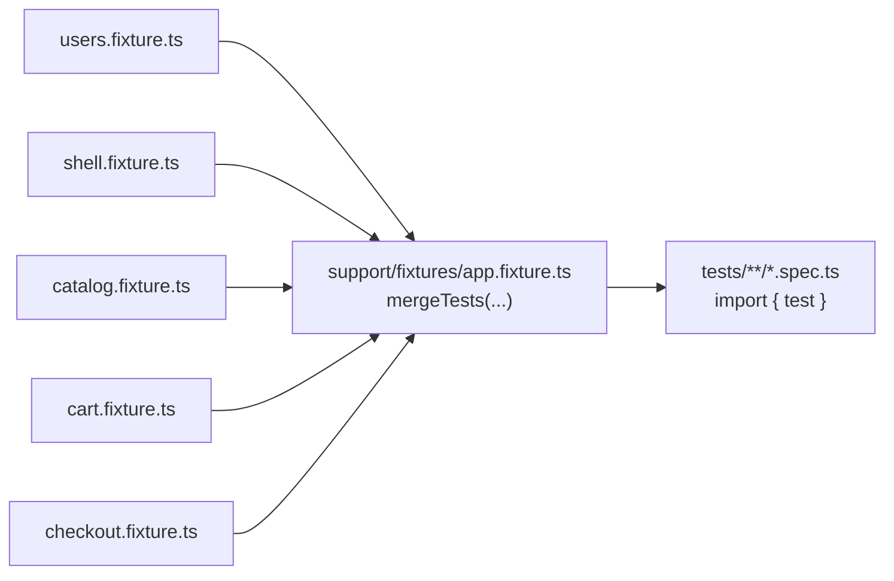
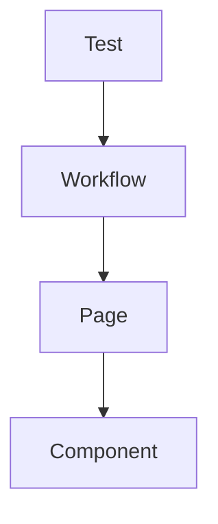

# Playwright architecture TLDR

Demo app: <https://pw-framework-example.vercel.app/>

This is not a proposal to rewrite everything around this repo.

This repo is a small example of three ideas we can apply gradually:

1. fixtures should be owned by modules, then merged at the root
2. support code should follow user behaviour: workflows call pages, pages compose components
3. `test.step` gives us readable BDD-style reporting without feature files and step-definition glue

The end goal is simple: tests that are easier to read, easier to own, and easier to change.

---

## 1. Fixtures should be owned by modules, then merged at the root

Fixtures are the public test surface for a module.

Instead of one large shared fixture file, each module owns a small fixture file for its own pages and workflows. The root fixture only merges those slices.

This keeps ownership local. If the catalog team adds a catalog page or catalog workflow, they change the catalog fixture. They do not need to edit a central fixture file full of unrelated areas.

### Show

- [Root fixture: `support/fixtures/app.fixture.ts`](../../support/fixtures/app.fixture.ts)
- [Catalog fixture: `support/modules/catalog/catalog.fixture.ts`](../../support/modules/catalog/catalog.fixture.ts)

```ts
// support/fixtures/app.fixture.ts
const merged = mergeTests(usersTest, shellTest, catalogTest, cartTest, checkoutTest);
```

```ts
// support/modules/catalog/catalog.fixture.ts
export type CatalogFixtures = {
  catalogPage: CatalogPage;
  productDetailPage: ProductDetailPage;
  browseCatalogWorkflow: BrowseCatalogWorkflow;
};
```

### Why this helps

- module ownership is visible in the repo structure
- fixture changes are smaller and safer
- adding a new module is one folder plus one line in `mergeTests`
- tests import one root `test`, but teams still own their own fixture slice



---

## 2. Support code should follow user behaviour: workflows call pages, pages compose components

The test should describe the user journey.

The workflow coordinates a journey inside a module.

The page represents one screen.

The component handles reusable UI pieces such as tables, headers, drawers, search boxes, modals, or steppers.

That gives us reuse without building another deep inheritance tree that only exists inside the automation framework.

### Show

- [Workflow: `support/modules/catalog/workflows/browse-catalog.workflow.ts`](../../support/modules/catalog/workflows/browse-catalog.workflow.ts)
- [Page: `support/modules/catalog/pages/catalog.page.ts`](../../support/modules/catalog/pages/catalog.page.ts)
- [Component: `support/shared/components/table.component.ts`](../../support/shared/components/table.component.ts)

```text
BrowseCatalogWorkflow
  -> CatalogPage
      -> HeaderComponent
      -> NavDrawerComponent
      -> SearchBoxComponent
      -> TableComponent
```

```ts
// support/modules/catalog/pages/catalog.page.ts
this.header = new HeaderComponent(page);
this.nav = new NavDrawerComponent(page);
this.searchBox = new SearchBoxComponent(page);
this.table = new TableComponent(page, page.getByRole("table", { name: "Products" }));
```

### Why this helps

- tests read closer to user behaviour
- pages are screens, not subclasses of random framework layers
- components make repeated UI patterns reusable
- workflows keep journey logic out of the test without hiding it in inheritance



For cross-module journeys, the spec composes multiple workflows. A catalog workflow should not secretly import checkout pages.

### Show

- [Cross-module test: `tests/checkout/checkout.purchase.spec.ts`](../../tests/checkout/checkout.purchase.spec.ts)

```ts
// tests/checkout/checkout.purchase.spec.ts
await shellWorkflow.openHome();
await membershipWorkflow.switchToMember();
await browseCatalogWorkflow.addProductToCart("Acme Widget", "acme-widget");
await cartWorkflow.proceedToCheckout();
const orderNumber = await checkoutWorkflow.placeOrder({ saveCard: true });
```

---

## 3. `test.step` gives readable BDD-style reporting without Cucumber glue

If we want Given/When/Then-style reporting, we can use Playwright's native `test.step`.

The test still uses TypeScript. We keep normal imports, normal method calls, IDE navigation, and compiler-checked refactors.

The Playwright HTML report still gets readable narrative steps.

### Show

- [BDD-style Playwright test: `tests/checkout/checkout.bdd.spec.ts`](../../tests/checkout/checkout.bdd.spec.ts)

```ts
await test.step("Given a member is on the store home", async () => {
  await shellWorkflow.openHome();
  await membershipWorkflow.switchToMember();
});

await test.step("When they add two products to the cart", async () => {
  await browseCatalogWorkflow.addProductToCart("Acme Widget", "acme-widget");
  await browseCatalogWorkflow.addProductToCart("Super Gizmo", "super-gizmo");
});
```

### Why this helps

- readable report steps
- no feature files
- no regex step definitions
- no extra Cucumber layer
- easier refactoring because the test is still TypeScript

```text
Cucumber:
feature file -> regex step definition -> workflow/page code

Playwright test.step:
test -> workflow -> page -> component
```

Cucumber can still make sense when business users actively write or maintain feature files. If developers and SDETs maintain the tests, `test.step` often gives most of the communication benefit with less framework cost.

---

## Walkthrough order

1. [Open the root fixture](../../support/fixtures/app.fixture.ts)
2. [Open one module fixture](../../support/modules/catalog/catalog.fixture.ts)
3. [Open one workflow](../../support/modules/catalog/workflows/browse-catalog.workflow.ts)
4. [Open one page](../../support/modules/catalog/pages/catalog.page.ts)
5. [Open one component](../../support/shared/components/table.component.ts)
6. [Open the normal cross-module purchase test](../../tests/checkout/checkout.purchase.spec.ts)
7. [Open the same idea with `test.step`](../../tests/checkout/checkout.bdd.spec.ts)

Stop there. The pitch is intentionally small.
